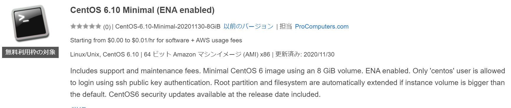

# LAMP環境を作成するまで
仕事でLAMP環境
※centos6.10 ,mysql 5.6.50 ,php7.3.25  
が必要になったので作成した時のメモをここに書いておきました。
おいおいcloudformationのテンプレートとかpulumiなどupできたらと思ってます。

# 1．AWSでインスタンス作成
・AWSにログインし
```
EC2->インスタンスの作成->AWS Marketplace->Centos6で検索
```
・以下のインスタンスを選択する。あとは手順に沿えばOK。※鍵の作成は調べればでてくるのでここでは省略。


・Teratermのショートカット作って
```
プロパティ->リンク先　に以下貼り付け
"C:\Program Files (x86)\teraterm\ttermpro.exe" [GLOBAL IP] /auth=publickey /user=centos /keyfile=[鍵(.pem)のフルパス]
```
これでショートカットダブルクリックで接続可能


# 2．centos6.10初期設定
・rootパスワード設定
```bash
$sudo su -
$passwd
```
・リポジトリの向き先が古いので変更
```bash
$sudo sed -i -e "s|mirror\.centos\.org/centos/\$releasever|vault\.centos\.org/6.6|g" /etc/yum.repos.d/CentOS-Base.repo
$sudo sed -i -e "s|#baseurl=|baseurl=|g" /etc/yum.repos.d/CentOS-Base.repo
$sudo sed -i -e "s|mirrorlist=|#mirrorlist=|g" /etc/yum.repos.d/CentOS-Base.repo
```
・更新
```bash
$sudo yum update
```

# 3．mysql5.6.50インストール
・インストール、初期起動に追加、起動、バージョン確認
```bash
$sudo yum -y install http://dev.mysql.com/get/mysql-community-release-el6-5.noarch.rpm
$sudo yum -y install mysql-community-server
$sudo chkconfig mysqld on
$sudo service mysqld start
$mysql --version
```
・初期設定～rootで接続まではここを参考
https://www.server-world.info/query?os=CentOS_6&p=mysql

・ユーザ作成と任意のIPから接続できるDBを作成
※IP制限はAWSのセキュリティグループにて行う
```
CREATE USER 'username'@'%' IDENTIFIED BY 'userpassword';
DROP USER 'username'@'%';
CREATE DATABASE dbname;
GRANT ALL PRIVILEGES ON dbname.* TO 'username'@'%';
```
・権限の確認(これで全部yになっていることを確認)
```
SELECT * FROM mysql.db WHERE user = 'username' AND host = '%' AND db = 'dbname' \G
```
# 4．php7.3.25インストール
・インストール、バージョン確認
```bash
$sudo yum install -y https://rpms.remirepo.net/enterprise/remi-release-6.rpm
$sudo yum install  -y --enablerepo=remi-php73 php
$php -v
```

# 5．visual studio codeのリモートエクスプローラでつなぎたいので以下
・wgetのインストールとlibstdc++、glibcのインストール
```bash
sudo yum -y install wget
wget http://copr-be.cloud.fedoraproject.org/results/mosquito/myrepo-el6/epel-6-x86_64/glibc-2.17-55.fc20/glibc-2.17-55.el6.x86_64.rpm
wget http://copr-be.cloud.fedoraproject.org/results/mosquito/myrepo-el6/epel-6-x86_64/glibc-2.17-55.fc20/glibc-common-2.17-55.el6.x86_64.rpm
wget http://copr-be.cloud.fedoraproject.org/results/mosquito/myrepo-el6/epel-6-x86_64/glibc-2.17-55.fc20/glibc-devel-2.17-55.el6.x86_64.rpm
wget http://copr-be.cloud.fedoraproject.org/results/mosquito/myrepo-el6/epel-6-x86_64/glibc-2.17-55.fc20/glibc-headers-2.17-55.el6.x86_64.rpm
wget https://copr-be.cloud.fedoraproject.org/results/mosquito/myrepo-el6/epel-6-x86_64/glibc-2.17-55.fc20/glibc-utils-2.17-55.el6.x86_64.rpm
wget https://copr-be.cloud.fedoraproject.org/results/mosquito/myrepo-el6/epel-6-x86_64/glibc-2.17-55.fc20/glibc-static-2.17-55.el6.x86_64.rpm
sudo rpm -Uvh \
    glibc-2.17-55.el6.x86_64.rpm \
    glibc-common-2.17-55.el6.x86_64.rpm \
    glibc-devel-2.17-55.el6.x86_64.rpm \
    glibc-headers-2.17-55.el6.x86_64.rpm \
    glibc-static-2.17-55.el6.x86_64.rpm \
    glibc-utils-2.17-55.el6.x86_64.rpm --force --nodeps
wget https://copr-be.cloud.fedoraproject.org/results/mosquito/myrepo-el6/epel-6-x86_64/gcc-4.8.2-16.3.fc20/libstdc++-4.8.2-16.3.el6.x86_64.rpm
wget  https://copr-be.cloud.fedoraproject.org/results/mosquito/myrepo-el6/epel-6-x86_64/gcc-4.8.2-16.3.fc20/libstdc++-devel-4.8.2-16.3.el6.x86_64.rpm
wget https://copr-be.cloud.fedoraproject.org/results/mosquito/myrepo-el6/epel-6-x86_64/gcc-4.8.2-16.3.fc20/libstdc++-static-4.8.2-16.3.el6.x86_64.rpm
sudo rpm -Uvh \
    libstdc++-4.8.2-16.3.el6.x86_64.rpm \
    libstdc++-devel-4.8.2-16.3.el6.x86_64.rpm \
    libstdc++-static-4.8.2-16.3.el6.x86_64.rpm
 ```
 ・リブート
  ```bash
  $sudo reboot
  ```
  
  ・visual studio codeのconfigに以下追加
  ※鍵の置き場所はCのユーザフォルダ以下じゃないと接続できない
  ```
  Host [任意]
    HostName [GLOBAL IP]
    IdentityFile [鍵(.pem)のフルパス]
    PreferredAuthentications publickey
    User centos
  ```
  
  
